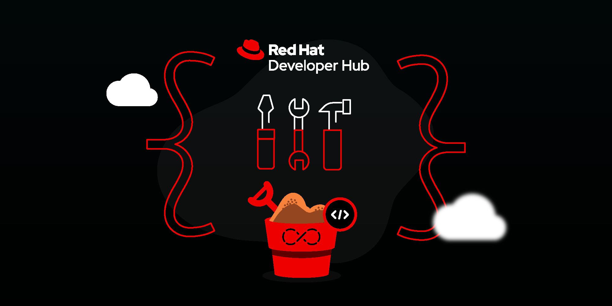
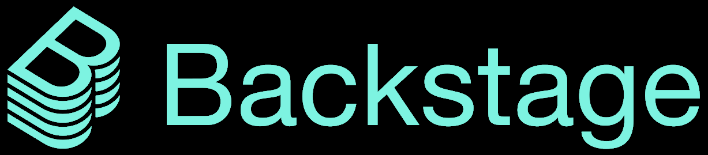

{ width="850" }

Developers love :heart: Red Hat Developer Hub. Developer Hub makes creating, discovering, and managing enterprise software faster and more productive for everyone! With Developer Hub, applications and APIs deployed across your organisation become easier to find, easier to understand, and easier to control. Our enterprise grade support ensures you stay on target while our open source community brings you exciting new innovations on a regular basis. 

Some of the worlds largest companies use Red Hat Developer Hub to:

* Build a self-service culture where developers are in control
* Promote sharing and common standards across teams
* Improve access to critical documentation, APIs, and services
* Integrate their favourite developer tools and dashboards in one handy portal 

!!! tip "RHDH Proudly Based On [Backstage](https://backstage.io)"

    Developer Hub is based on ~[{ width="122" }](https://backstage.io)~ the open-source developer Hub from Spotify.  Backstage enjoys a vibrant user community and a fast growing ecosystem of useful extensions called "[plugins](https://developers.redhat.com/rhdh/plugins "plugins")". Many leading platform vendors (including  Red Hat) are contributing [code](https://github.com/janus-idp "source code") to the Backstage project to ensure the developer experience is as rich and rewarding as possible.

*[GUI]: Graphical User Interface (sometimes shortened to UI).
*[IDP]: Internal Developer Platform - a system intended to make iy easier to develop, secure, operate, and manage applications running on your cloud infrastructure.

<!-- !!! info "Feature Highlights & Getting Started"
    
    The [feature highlights](./features.md) of Developer Hub include an enhanced developer experience and greater developer productivity. Check out our [Getting Started Guide](./get-started.md) to quickly get up to speed with these features. -->
